# This tutorial is used for doing haplotype phasing using [PhaseExtender](https://github.com/everestial/phase-Extender). It also compares the phase quality of the haplotype produced against haplotype produced by ShapeIT

## Note: Parts of this tutorial can also be used as a method for doing recursive phaseExtension with ReadBackPhased data (Starting from Step 03)

### Specific goal of the tutorial

Infer haplotype of the HapMap Sample (NA12891 from b36) using **phaseExtender** and test the phase quality using switcherror metrices. The reported phased haplotype from several several **phaseExtender** runs is then compared to phased haplotype reported by **ShapeIT** as reported in these tutorials:

- <https://gist.github.com/zhanxw/3c4e764cf1a3be6eb74c88dff08be3f4>
- <https://portal.biohpc.swmed.edu/content/training/bioinformatics-nanocourses/gwas/zhan-phasing-workshop/>

**Required files:** Same files used with "ShapeIT". The zipped file is available as [HapMap3_r2_b36_2009.zip](https://github.com/everestial/TestSwitchErrors/blob/master/HapMap3_r2_b36_2009.zip)

- We need three types of file: Haps/Sample/Legend
- geneticMap file is ignored in phaseExtender

The language used in this tutorial vary between `python`, `R` and `bash`. The codes are included at each step. However, the associated codes are also made available as separate files.

### Prerequisites

This app is written in python3, so you need to have python3 installed on your system to run this code locally. If you don't have python installed then, you can install from [here](https://www.python.org/downloads/). For linux; you can get latest python3 by:

`sudo apt-get install python3`

### Installation  and setup

1. Clone this repo.

```bash
git clone https://github.com/everestial/TestSwitchErrors.git
cd TestSwitchErrors
```

2. Make virtual env for python and install requirements.

```bash
python3 -m venv myenv
source myenv/bin/activate   # for linux
myenv\Scripts\activate      # for windows
pip install -r requirements.txt
```

### Step 01: Check metrices of the inputfiles

This is covered under the tutorial that runs haplotype phasing for sample (NA12891) using **ShapeIT**.

### Step 02: Prepare ReadBackPhased "HAPLOTYPE" file

>**Note:** This is a simulation based preparation of RBphased haplotype from available reference panel [of Chr22 from b36, 2009](https://mathgen.stats.ox.ac.uk/impute/data_download_hapmap3_r2.html). Other versions of reference panel are available [here](https://mathgen.stats.ox.ac.uk/impute/impute_v2.html#reference)

 To run phase extension on the RBphased haplotype for your own data you will need aligned **BAM** and **VCF**. This data can be used with [phaser](https://github.com/secastel/phaser/tree/master/phaser), [HapCut2](https://github.com/vibansal/HapCUT2), or [GATK ReadBackPhasing](https://software.broadinstitute.org/gatk/documentation/tooldocs/3.8-0/org_broadinstitute_gatk_tools_walkers_phasing_ReadBackedPhasing.php) to create appropriate **HAPLOTYPE** file required by phaseExtender. After preparation of such RBphased data, you can directly skip to Step 03 to see how further phase extension is done. A detailed tutorial for preparation of HAPLOTYPE file is described [here](https://github.com/everestial/phaseRB)

**This is what we will do in this step:**

- Create HAPLOTYPE file compatible with **phaseExtender**
     > **Note:** Unlike **ShapeIT** **phaseExtender** takes haplotype as IUPAC base.
- first we select 9 random samples (SetA) and then 24 random samples (SetB) from CEU population. In addition to this random samples we will include sample (NA12891) making the final SetA at 10 samples and SetB at 25 samples.
- we will then convert haplotype for these samples into HAPLOTYPE file in IUPAC base format. The original HAPLOTYPE file for all the samples is then stored as "truth set".
- We will then take this truth set and create a simulated ReadBackPhased HAPLOTYPE file (required by phaseExtender) for all the samples.

    > **Note:** We will use small python application called **`makeHapFile.py`** which will cover all the above steps. This file is provided along with this turorial.

    In the simulated data the number of ReadBackPhased heterozygote variants in the ReadBackphased blocks is simulated to follow a poisson like distribution (not exactly possion but has a right skew). The mean number of RBphased variants is picked randomly at (5, 6, or 7) with min number of variants at 3 and maximum at 30. The simulation creates a distribution that is likely observed in real RBphased haplotype data.

- The simulated ReadBackPhased HAPLOTYPE file is then used with **phaseExtender** to improve phasing.
    >**Note:** Unlike in **ShapeIT** method which runs haplotype phasing of 1 sample, with **phaseExtender** we improve the phasing for all the samples.
   But, in this tutorial we will then compare the phasing quality only for sample (NA12891).

- Then we will join the output haplotype for each samples to a single file. This file will be used to run another round of phase extension. And we will again compare the phasing quality of sample (NA12891). This way we can recursively apply haplotype phase improvements until optimal results are obtained.

## Now, we begin our phase extension using phaseExtender

All, the required input files and scripts file for this tutorial is available at [TestSwitchErrors](https://github.com/everestial/TestSwitchErrors).

### Step 02-A: Prepare HAPLOTYPE data (truth set and simulated set) (Optional)

You can use your own data. But if you want to just test this application first. You can download sample data provided in this application by:

```bash

wget https://github.com/everestial/TestSwitchErrors/raw/master/HapMap3_r2_b36_2009.zip -O HapMap3_r2_b36_2009.zip
unzip data/HapMap3_r2_b36_2009.zip
mv HapMap3_r2_b36_2009/ data/

```

#### Set A: make HAPLOTYPE file with 10 samples

``` html
We are using samples:
NA07056,NA06989,NA12891,NA12890,NA12875,NA12827,NA06985,NA12763,NA11917,NA12892
```

```bash
#check if required files are there
$ ls data/HapMap3_r2_b36_2009/
genetic_map_chr20_combined_b36.txt  hapmap3_r2_b36_chr20.haps
hapmap3_r2_b36_all.sample           hapmap3_r2_b36_chr20.legend

# make directory to store the file for simulated "SetA"
$ mkdir data/SetA
# this will create an empty directory "SetA"
```

```python
# now, run the python script 
$ python3 makeHapFile.py -haps data/HapMap3_r2_b36_2009/hapmap3_r2_b36_chr20.haps -legend data/HapMap3_r2_b36_2009/hapmap3_r2_b36_chr20.legend -sample_file data/HapMap3_r2_b36_2009/hapmap3_r2_b36_all.sample -chr 20 -samples NA07056,NA06989,NA12891,NA12890,NA12875,NA12827,NA06985,NA12763,NA11917,NA12892 -output_truth data/SetA/truth_RBphasedHaplotype_SetA.txt -output_sim data/SetA/simulated_RBphasedHaplotype_SetA.txt
```

Purpose of the application : This application simulates ReadBackPhased haplotype given *.haps,*.legend and *.sample file are provided.

```bash
# navigate to the directory that contains "SetA" data set
# and you should be able to see both the "truth" and "simulated" haplotype data set.
$ ls data/SetA
simulated_RBphasedHaplotype_SetA.txt  truth_RBphasedHaplotype_SetA.txt

```

#### We will now use this **`simulated_RBphasedHaplotype_SetA.txt`** with **phaseExtender**

This simulated set may not be exactly the same because the RBphased haplotype are generated with some randomness. If you want to use the same exact simulated data you can copy and replace the generated simulation file. i.e "simulated_RBphasedHaplotype_SetA.txt".

**But, before doing any further phase extension let's make another simulated set (i.e `SetB`) of RBphased haplotype using 25 samples. So we can compare how sample size effects phasing quality in phaseExtender.**

#### Set B: Make another HAPLOTYPE file with 25 samples 

``` bash
We are using samples:
NA12891,NA12892,NA06989,NA11917,NA12283,NA07056,NA11992,NA12057,NA12383,NA12154,NA12749,NA12890,NA12776,NA12827,NA12342,NA11891,NA11920,NA12778,NA12763,NA12399,NA11995,NA12750,NA12875,NA06985,NA12400
```

```python
# make another directory to store files for SetB
$ mkdir data/SetB

# now, run the python script 
$ python3 makeHapFile.py -haps data/HapMap3_r2_b36_2009/hapmap3_r2_b36_chr20.haps -legend data/HapMap3_r2_b36_2009/hapmap3_r2_b36_chr20.legend -sample_file data/HapMap3_r2_b36_2009/hapmap3_r2_b36_all.sample -chr 20 -samples NA12891,NA12892,NA06989,NA11917,NA12283,NA07056,NA11992,NA12057,\
NA12383,NA12154,NA12749,NA12890,NA12776,NA12827,NA12342,NA11891,\
NA11920,NA12778,NA12763,NA12399,NA11995,NA12750,NA12875,NA06985,NA12400 -output_truth data/SetB/truth_RBphasedHaplotype_SetB.txt -output_sim data/SetB/simulated_RBphasedHaplotype_SetB.txt
```

##### We have now completed preparation of RBphased haplotypes. Keep in mind though that these RBphased data are not prepare from VCF but are simulated

Also, the simulated data for Set B may not be exact to the one used in this tutorial.

### Step 03 - Run haplotype phasing using HAPLOTYPE file

The tutorial starting from Step 03 can be used as a model to run haplotype phasing for the data obtained from RBphased VCFs

#### Step 03 -I Set (A): for HAPLOTYPE file with 10 samples

```bash
## make sure that the "phaseExtender" and required dependencies are installed
# We can run phasing for single sample "NA12891" as 
$ phase-extender --input data/SetA/simulated_RBphasedHaplotype_SetA.txt --SOI NA12891 --output data/SetA/phasedNA12891_SetA02 --numHets 25 --lods 5 --writeLOD yes --hapStats yes --addMissingSites no 
```

Look at scripts for [phase-extender for multiple samples](Scripts/PhaseExtenderOnForLoop_SetA.sh)

```bash
$ source ./Scripts/PhaseExtenderOnForLoopSetA.sh
```

#### Now, check the quality of the phased data

**Note:** (skip this step if running phase extension on your own data)

To do this we compare the **truth haplotype for SetA (i.e `"data/SetA/truth_RBphasedHaplotype_SetA.txt"`)** with the **output file (i.e `"SetA_run02/phaseExtendedHaplotype_SetA_02.txt"`)**. But, here we only compare the haplotype of sample "NA12891".

>NOTE: for comparision of data produced in setA and setB refer to [this notebook](Scripts/notebook/Merge%20haplotypes%20stats%20and%20plot%20data.ipynb)

**Result:** after accounting for haplotype breaks the switch error is 0.03269 which is comparable to ShapeIT as described in this tutorial

- <https://gist.github.com/zhanxw/3c4e764cf1a3be6eb74c88dff08be3f4>
- <https://portal.biohpc.swmed.edu/content/training/bioinformatics-nanocourses/gwas/zhan-phasing-workshop/>

**Result:** after accounting for haplotype breaks the switch error is 0.03269 which is comparable to ShapeIT as described in this tutorial

> Note: For detail analysis of set A data for 10 samples visit [this notebook](Scripts/notebook/SwitchErrorTest_PhaseExtenderSetA.ipynb)


#### Make histogram and density plot


Histogram plot of haplotype size distribution after phase extension            |  Density plot of haplotype size distribution after phase extension
:-------------------------:|:-------------------------:
 | 


The haplotype in **SetA_02** are still not a global haplotype but rather larger blocks produced by joining smaller blocks. You can compare the haplotype size distribution (of sample "NA12891") before vs. after the first run. **This plots are available in the folder "../data/SetA/phased_NA12891_SetA_run01"**

**Haplotype size distribution by number of variants.**

Haplotype size distribution before phaseExtension            |  Haplotype size distribution after phaseExtension
:-------------------------:|:-------------------------:
  |  

**Haplotype size distribution by genomic distance.**

Haplotype size distribution before phaseExtension               |  Haplotype size distribution after phaseExtension  
:-------------------------:|:-------------------------:
  |  

**So, now we proceed another round of phase extension.**

### Step 03-II: Recursive (run 02) haplotype phasing of data SetA

To make a global phased haplotype we will go through another round of phase extension. We can run the phase extension recursively until you desire. **To control for how the phase extension proceeds, "phaseExtender" provides control over several parameters.**

- "numHets" : the maximum number of heterozygous that will be used to compute LODS score between blocks.
  - The larger the numHets the larger is the computed LODS score. But, there is a limit to it. The LODS will decrease if the blocks being joined are very large and the ends of the two joining blocks are at LD of about 50.
  - To account for this problem "phaseExtender" starts computation by running markov chains between the SNPs that are closest betweent the two consecutive blocks. So, it will help to keep low "numHets" as recurssion progresses.
- "lods" : the lods cutoff threshold.
  - I suggest using large cutoff at the beginning and proceed to low cutoff as the recursion progresses.
- "culLH" : the likelihoods of the lods can be either max summed or max-producted.
- "snpTh" : minimum number of SNPs required in a block so it can be phase extended.
  - the default value is at "3". I suggest using higher snpTh as the beginning but decreasing it as recurssion progresses.
- "useSample" : to only use select samples to run phaseExtension. This is helpful if you want to cluster phasing by groups first to make large blocks, before doing any recursive phase extension.

**I plan on doing only one more round of phaseExtension. So, I will keep the several parameters low (`numHets 40`, `lods 1`), so a few but large haplotype blocks can be prepared.**

The codes used in this round of phase extension is provided as `BASH SHELL` [ this script file ](PhaseExtenderOnForLoop_SetA_02.sh).

**To run the file :**

```bash
# simply do
$ ./Scripts/PhaseExtenderOnForLoop_SetA_02.sh
```

**and it will automatically run the following process :**

- **a)** run phaseExtension on a for-loop which will produce output for each sample as "SampleNamme_run02"
- **b)** merge the haplotype output for each sample in new directory **(SetA_03)**
- **c)** copy the merged haplotype as a new file **"phaseExtendedHaplotype_SetA_03.txt"**
- **d)** and extract the phased haplotype set for sample "NA12891" as file named **"phased_Haplotype_NA12891.txt"**.

## Now, check the quality of the phased data

**Note:** (skip this step if running phase extension on your own data)

To do this we compare the **truth haplotype of sample "NA12891" for SetA (i.e `"data/SetA/truth_Haplotype_NA12891.txt"`)** with the **output file (i.e `"SetA_03/phased_Haplotype_NA12891.txt"`)**.

The R script file making comparison of the truth set against phased set is available as [notebook](Scripts/notebook/SwitchErrorTest_PhaseExtenderSetA_02.ipynb).

Result: In this second round of phase extension we were able to reduce the switch error to 0.01665632 (before accounting for haplotype breaks) and 0.01748396 (after accounting for haplotype breaks).

Overall we were able to join smaller haplotypes and reduce haplotype frequency from 1381 to 267 in first phase extension (run 01) and from 267 to 23 in second phase extension (run 02). With further recursive phase extension we should be able to create global haplotype.


Initial number of RBphased haplotypes (n=1381) | Number of RBphased haplotypes after first phase extension (n=267) | Number of RBphased haplotypes after second round of phase extension (n=23)
:-------------------------:|:-------------------------:|:-------------------------:
 |  | 

##### This concludes the testing of switch error for data SetA

## 03 - Set (B) : Phase extension for HAPLOTYPE file with 25 samples

The SetA data only had 10 samples. Here we take 25 samples to see how it affects haplotype phasing. The process for running haplotype phaseExtension on samples from `SetB` is typically the same as above except the sample names.
[Script file](Scripts/PhaseExtenderOnForLoop_SetB.sh) which covers all the steps from phasing, merging each phased samples, to extracting phased haplotype for sample ***"NA12891"**.

```bash
# simply run
$ ./PhaseExtenderOnForLoop_SetB.sh
```

**which will:**

- run phase extension on all 25 samples inside **SetB**.
- merge the haplotype files into a single HAPLOTYPE file "merged_haplotype.txt" inside the directory **SetB_02** and further rename it to "".

### Test switch errors for set B

Now, take the data and compute switch errors. The **R** script is available as notebook [SwitchErrorTest_PhaseExtenderSetB](Scripts/notebook/SwitchErrorTest_PhaseExtenderSetB.ipynb).

Haplotype switch points without accounting for haplotype breaks (SE rate = 0.01272502) | Haplotype switch points after accounting for haplotype breaks (SE rate = 0.0190358)
:-------------------------:|:-------------------------:
 | 

**Result:** You can see that there are fewer switchpoints when sample size is increased from 10 to 25

#### Changes in number and size of haplotypes (by number of variants) before vs. after phase extension

Haplotype size distribution before phase extension | Haplotype size distribution after phase extension
:-------------------------:|:-------------------------:
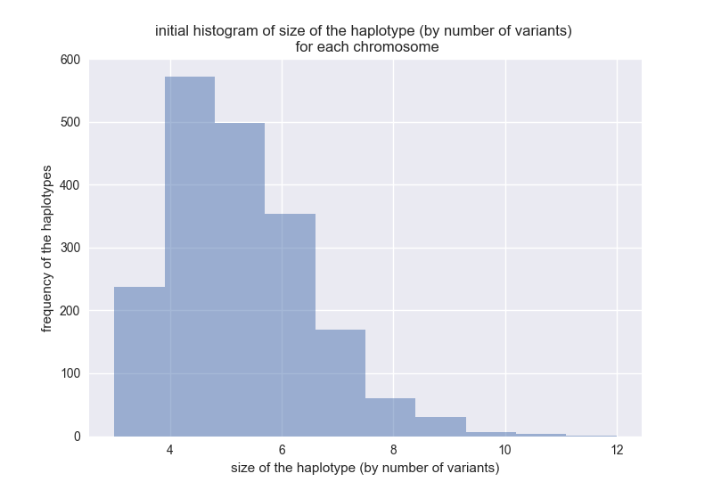 | 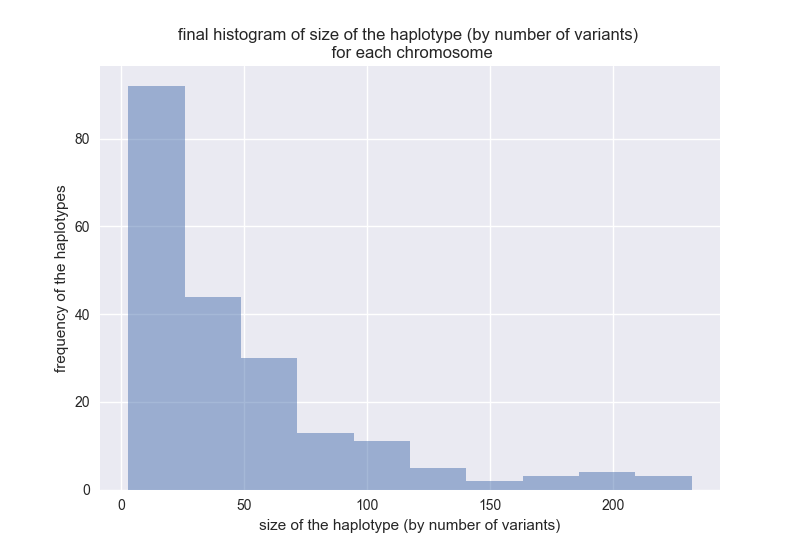

Number of haplotypes before phase extension (n = 1381) | Number of haplotypes after phase extension (n = 155)
:-------------------------:|:-------------------------:
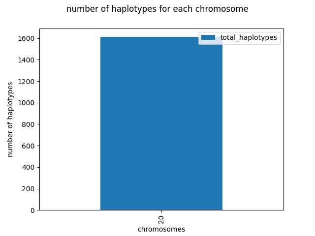 | 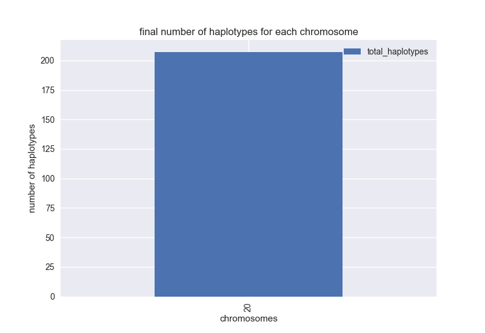

### 04 - (B): Recursive (run 02) haplotype phase extension of data SetB

The `BASH SHELL` script is available as file [PhaseExtenderOnForLoop_SetB_02.sh](Scripts/PhaseExtenderOnForLoop_SetB_02.sh). We are keeping lods cutoff low at "1".

```bash
# simply run
$ ./Scripts/PhaseExtenderOnForLoop_SetB_02.sh
```

The phased output for each sample will be inside directory **SetB_02/**. The merged haplotype file will be created in directory **SetB_03/**. The SHELL script also has codes to extract truth and phased haplotype for sample **"NA12891"**.

#### Test switch errors for second iteration of Set B

The `R` notebook for checking quality of the phasing is available as [ R notebook SwitchErrorTest_PhaseExtenderSetB_02.ipynb](Scripts/notebook/SwitchErrorTest_PhaseExtenderSetB_02.ipynb).

#### Results

With 25 samples phaseExtender was able to reduce the switch error rates to **0.009828264** after 1 recursive phasing (after accounting for haplotype breaks). The number of haplotypes decreased from .... to ....

Number of haplotypes before phase extension (n = 1381) | Number of haplotypes after phase extension (n = 155) | Number of haplotypes after phase extension (n = 7)
:-------------------------:|:-------------------------:|:-------------------------:
 |  | 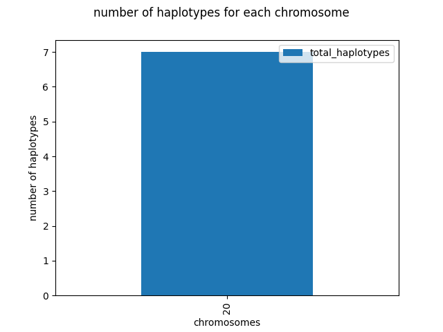

#### Histogram of Haplotype size distribution (by number of variants)

Initial | after run 01 | after run 02
:-------------------------:|:-------------------------:|:-------------------------:
 |  | 

#### Histogram of Haplotype size distribution ((by genomic distance)

Initial | after run 01 | after run 02
:-------------------------:|:-------------------------:|:-------------------------:
 |  | 

While the haplotypes weren't phased genome wide, another recursive haplotype phasing should yield genome wide haplotype even with lower phasing error. The already joined blocks with switchpoint will stay as they are but tuning the parameter like "lods", "numHets", "useSample", "snpTh" provides a highly controllable haplotype phasing in organisms with no available reference panel.

### Compare results from "SetA" and "SetB"

**conclusion** - Increasing the sample size improves phasing but with phaseExtender you are able to get good quality phasing even with sample size as small as 10 when recursive phasing is applied.

Additionally, for some positions we are able to get good resolution of proper phase state by taking low sample size. This can be seen in the phasing of block 1 & 2 in sample NA12891.


|Set A | Set B|
:-------------------------:|:-------------------------:
|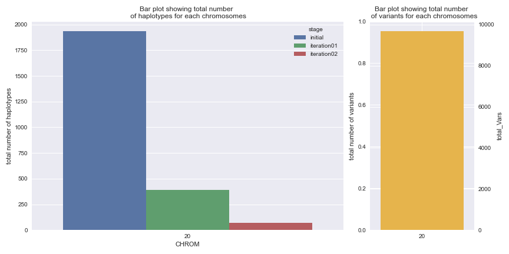 | 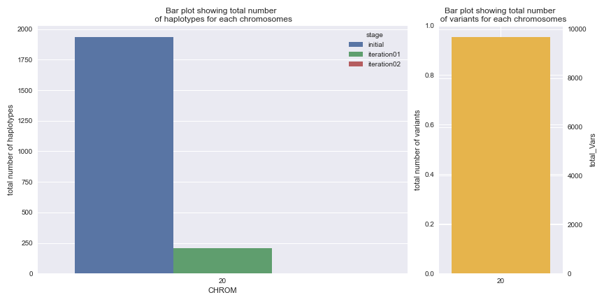|

#### Histogram of Haplotype size distribution (by number of variants)


|Set A | Set B|
:-------------------------:|:-------------------------:
|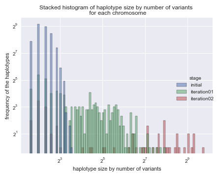 | 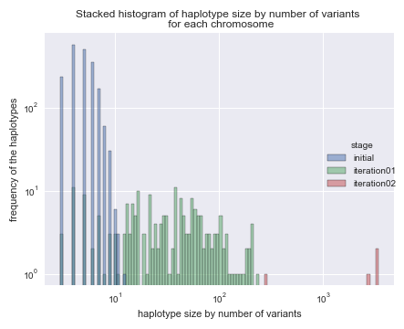|

#### Histogram of Haplotype size distribution ((by genomic distance)


|Set A | Set B|
:-------------------------:|:-------------------------:
|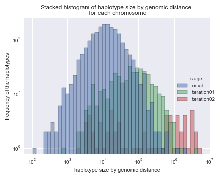 | 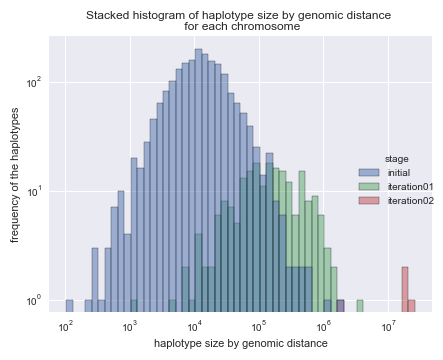|

### Final Stats

##### For Set A NA12891 sample
| CHROM | max_range_pi | min_range_pi | max_num_vars_pi | min_num_vars_pi | stage       |
| ----- | ------------ | ------------ | --------------- | --------------- | ----------- |
| 20    | 2057927      | 104          | 12              | 3               | initial     |
| 20    | 4386983      | 753          | 237             | 3               | iteration01 |
| 20    | 6022477      | 2245         | 879             | 3               | iteration02 |

### For Set B NA12891 sample

| CHROM | max_range_pi | min_range_pi | max_num_vars_pi | min_num_vars_pi | stage       |
| ----- | ------------ | ------------ | --------------- | --------------- | ----------- |
| 20    | 2057927      | 104          | 12              | 3               | initial     |
| 20    | 3442116      | 1290         | 232             | 3               | iteration01 |
| 20    | 26087506     | 1949133      | 3386            | 284             | iteration02 |

***to add***
N50 for the truth set, phased set01, set02, 03.
switchError per mb
phasedSet of sample NA12878.
