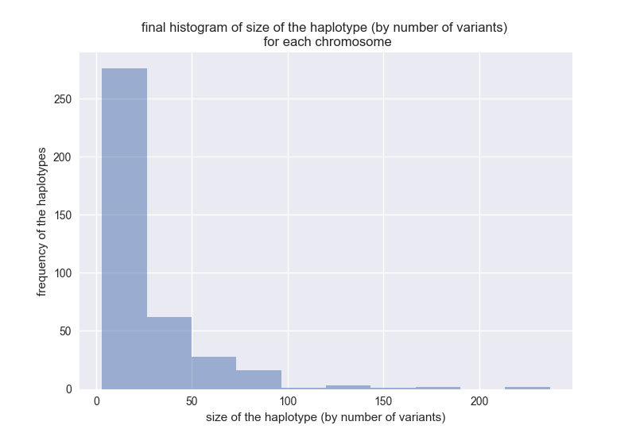
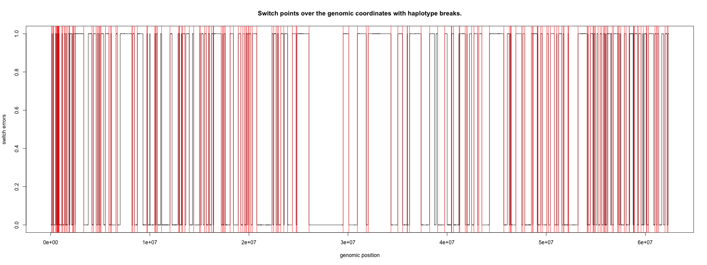

# This tutorial is used for doing haplotype phasing using [PhaseExtender](https://github.com/everestial/phase-Extender). It also compares the phase quality of the haplotype produced against haplotype produced by ShapeIT

## Note: Parts of this tutorial can also be used as a method for doing recursive phaseExtension with ReadBackPhased data (Starting from Step 03)

### Specific goal of the tutorial


Infer haplotype of the HapMap Sample (NA12891 from b36) using **phaseExtender** and test the phase quality using switcherror metrices. The reported phased haplotype from several several **phaseExtender** runs is then compared to phased haplotype reported by **ShapeIT** as reported in these tutorials:

- <https://gist.github.com/zhanxw/3c4e764cf1a3be6eb74c88dff08be3f4>
- <https://portal.biohpc.swmed.edu/content/training/bioinformatics-nanocourses/gwas/zhan-phasing-workshop/>

**Required files:** Same files used with "ShapeIT". The zipped file is available as [HapMap3_r2_b36_2009.zip](https://github.com/everestial/TestSwitchErrors/blob/master/HapMap3_r2_b36_2009.zip)

- We need three types of file: Haps/Sample/Legend
- geneticMap file is ignored in phaseExtender

The language used in this tutorial vary between `python`, `R` and `bash`. The codes are included at each step. However, the associated codes are also made available as separate files.

### Prerequisites

This app is written in python3, so you need to have python3 installed on your system to run this code locally. If you don't have python installed then, you can install from [here](https://www.python.org/downloads/). For linux; you can get latest python3 by:

`sudo apt-get install python3`

### Installation  and setup

1. Clone this repo.

```bash
git clone https://github.com/everestial/TestSwitchErrors.git
cd TestSwitchErrors
```

2. Make virtual env for python and install requirements.

```bash
python3 -m venv myenv
source myenv/bin/activate   # for linux
myenv\Scripts\activate      # for windows
pip install -r requirements.txt
```

### Step 01: Check metrices of the inputfiles

This is covered under the tutorial that runs haplotype phasing for sample (NA12891) using **ShapeIT**.

### Step 02: Prepare ReadBackPhased "HAPLOTYPE" file

>**Note:** This is a simulation based preparation of RBphased haplotype from available reference panel [of Chr22 from b36, 2009](https://mathgen.stats.ox.ac.uk/impute/data_download_hapmap3_r2.html). Other versions of reference panel are available [here](https://mathgen.stats.ox.ac.uk/impute/impute_v2.html#reference)

 To run phase extension on the RBphased haplotype for your own data you will need aligned **BAM** and **VCF**. This data can be used with [phaser](https://github.com/secastel/phaser/tree/master/phaser), [HapCut2](https://github.com/vibansal/HapCUT2), or [GATK ReadBackPhasing](https://software.broadinstitute.org/gatk/documentation/tooldocs/3.8-0/org_broadinstitute_gatk_tools_walkers_phasing_ReadBackedPhasing.php) to create appropriate **HAPLOTYPE** file required by phaseExtender. After preparation of such RBphased data, you can directly skip to Step 03 to see how further phase extension is done. A detailed tutorial for preparation of HAPLOTYPE file is described [here](https://github.com/everestial/phaseRB)

**This is what we will do in this step:**

- Create HAPLOTYPE file compatible with **phaseExtender**
     > **Note:** Unlike **ShapeIT** **phaseExtender** takes haplotype as IUPAC base.
- first we select 9 random samples (SetA) and then 24 random samples (SetB) from CEU population. In addition to this random samples we will include sample (NA12891) making the final SetA at 10 samples and SetB at 25 samples.
- we will then convert haplotype for these samples into HAPLOTYPE file in IUPAC base format. The original HAPLOTYPE file for all the samples is then stored as "truth set".
- We will then take this truth set and create a simulated ReadBackPhased HAPLOTYPE file (required by phaseExtender) for all the samples.

    > **Note:** We will use small python application called **`makeHapFile.py`** which will cover all the above steps. This file is provided along with this turorial.

    In the simulated data the number of ReadBackPhased heterozygote variants in the ReadBackphased blocks is simulated to follow a poisson like distribution (not exactly possion but has a right skew). The mean number of RBphased variants is picked randomly at (5, 6, or 7) with min number of variants at 3 and maximum at 30. The simulation creates a distribution that is likely observed in real RBphased haplotype data.

- The simulated ReadBackPhased HAPLOTYPE file is then used with **phaseExtender** to improve phasing.
    >**Note:** Unlike in **ShapeIT** method which runs haplotype phasing of 1 sample, with **phaseExtender** we improve the phasing for all the samples.
   But, in this tutorial we will then compare the phasing quality only for sample (NA12891).

- Then we will join the output haplotype for each samples to a single file. This file will be used to run another round of phase extension. And we will again compare the phasing quality of sample (NA12891). This way we can recursively apply haplotype phase improvements until optimal results are obtained.

## Now, we begin our phase extension using phaseExtender

All, the required input files and scripts file for this tutorial is available at [TestSwitchErrors](https://github.com/everestial/TestSwitchErrors).

### Step 02-A: Prepare HAPLOTYPE data (truth set and simulated set)

You can use your own data. But if you want to just test this application first. You can download sample data provided in this application by:

```bash

wget https://github.com/everestial/TestSwitchErrors/raw/master/HapMap3_r2_b36_2009.zip -O HapMap3_r2_b36_2009.zip
unzip data/HapMap3_r2_b36_2009.zip
mv HapMap3_r2_b36_2009/ data/

```

#### Set A: make HAPLOTYPE file with 10 samples

``` html
We are using samples:
NA07056,NA06989,NA12891,NA12890,NA12875,NA12827,NA06985,NA12763,NA11917,NA12892
```

```bash
#check if required files are there
$ ls data/HapMap3_r2_b36_2009/
genetic_map_chr20_combined_b36.txt  hapmap3_r2_b36_chr20.haps
hapmap3_r2_b36_all.sample           hapmap3_r2_b36_chr20.legend

# make directory to store the file for simulated "SetA"
$ mkdir data/SetA
# this will create an empty directory "SetA"
```

```python
# now, run the python script 
$ python3 makeHapFile.py -haps data/HapMap3_r2_b36_2009/hapmap3_r2_b36_chr20.haps -legend data/HapMap3_r2_b36_2009/hapmap3_r2_b36_chr20.legend -sample_file data/HapMap3_r2_b36_2009/hapmap3_r2_b36_all.sample -chr 20 -samples NA07056,NA06989,NA12891,NA12890,NA12875,NA12827,NA06985,NA12763,NA11917,NA12892 -output_truth data/SetA/truth_RBphasedHaplotype_SetA.txt -output_sim data/SetA/simulated_RBphasedHaplotype_SetA.txt
```

Purpose of the application : This application simulates ReadBackPhased haplotype given *.haps,*.legend and *.sample file are provided.

``` bash
Extracting haplotype data for each sample of interest .....
Sample 1 :  NA06989
Sample 2 :  NA10850
Sample 3 :  NA06984
Sample 4 :  NA07056
Sample 5 :  NA12045
Sample 6 :  NA11843
Sample 7 :  NA12890
Sample 8 :  NA12889
Sample 9 :  NA12892
Sample 10 :  NA12891

Writing truth set haplotype data to a file data/SetA/truth_RBphasedHaplotype_SetA.txt ....

Writing simulated set haplotype data to a file data/SetA/simulated_RBphasedHaplotype_SetA.txt; ....

Process completed !!! :) :)
```

```bash
# navigate to the directory that contains "SetA" data set
# and you should be able to see both the "truth" and "simulated" haplotype data set.
$ ls data/SetA
simulated_RBphasedHaplotype_SetA.txt  truth_RBphasedHaplotype_SetA.txt

```

#### We will now use this **`simulated_RBphasedHaplotype_SetA.txt`** with **phaseExtender**

This simulated set may not be exactly the same because the RBphased haplotype are generated with some randomness. If you want to use the same exact simulated data you can copy and replace the generated simulation file. i.e "simulated_RBphasedHaplotype_SetA.txt".

**But, before doing any further phase extension let's make another simulated set (i.e `SetB`) of RBphased haplotype using 25 samples. So we can compare how sample size effects phasing quality in phaseExtender.**

#### Set B: Make another HAPLOTYPE file with 25 samples

``` bash
We are using samples:
NA12891,NA12892,NA06989,NA11917,NA12283,NA07056,NA11992,NA12057,NA12383,NA12154,NA12749,NA12890,NA12776,NA12827,NA12342,NA11891,NA11920,NA12778,NA12763,NA12399,NA11995,NA12750,NA12875,NA06985,NA12400
```

```python
# make another directory to store files for SetB
$ mkdir data/SetB

# now, run the python script 
$ python3 makeHapFile.py -haps data/HapMap3_r2_b36_2009/hapmap3_r2_b36_chr20.haps -legend data/HapMap3_r2_b36_2009/hapmap3_r2_b36_chr20.legend -sample_file data/HapMap3_r2_b36_2009/hapmap3_r2_b36_all.sample -chr 20 -samples NA12891,NA12892,NA06989,NA11917,NA12283,NA07056,NA11992,NA12057,\
NA12383,NA12154,NA12749,NA12890,NA12776,NA12827,NA12342,NA11891,\
NA11920,NA12778,NA12763,NA12399,NA11995,NA12750,NA12875,NA06985,NA12400 -output_truth data/SetB/truth_RBphasedHaplotype_SetB.txt -output_sim data/SetB/simulated_RBphasedHaplotype_SetB.txt
```

```html

Purpose of the application : This application simulates ReadBackPhased haplotype given *.haps,*.legend and *.sample file are provided.

Extracting haplotype data for each sample of interest .....
Sample 1 :  NA06989
Sample 2 :  NA11917
Sample 3 :  NA12283
Sample 4 :  NA07056
Sample 5 :  NA11992
Sample 6 :  NA12057
Sample 7 :  NA12383
Sample 8 :  NA12154
Sample 9 :  NA12749
Sample 10 :  NA12890
Sample 11 :  NA12776
Sample 12 :  NA12827
Sample 13 :  NA12342
Sample 14 :  NA11891
Sample 15 :  NA11920
Sample 16 :  NA12778
Sample 17 :  NA12400
Sample 18 :  NA12399
Sample 19 :  NA12763
Sample 20 :  NA12892
Sample 21 :  NA12891
Sample 22 :  NA06985
Sample 23 :  NA11995
Sample 24 :  NA12750
Sample 25 :  NA12875

Writing truth set haplotype data to a file &quot;data/SetB/truth_RBphasedHaplotype_SetB.txt&quot; ....

Writing simulated set haplotype data to a file &quot;data/SetB/simulated_RBphasedHaplotype_SetB.txt&quot; ....

Process completed !!! :) :)
```

##### We have now completed preparation of RBphased haplotypes. Keep in mind though that these RBphased data are not prepare from VCF but are simulated

Also, the simulated data for Set B may not be exact to the one used in this tutorial.

### Step 03 - Run haplotype phasing using HAPLOTYPE file

#### The tutorial starting from Step 03 can be used as a model to run haplotype phasing for the data obtained from RBphased VCFs

#### 03 - Set (A): for HAPLOTYPE file with 10 samples

```bash
## make sure that the "phaseExtender" and required dependencies are installed
# We can run phasing for single sample "NA12891" as 
python phase-Extender.py --input data/SetA/simulated_RBphasedHaplotype_SetA.txt --SOI NA12891 --output temp5 --numHets 25 --lods 5 --writeLOD yes --hapStats yes --addMissingSites no 
$ python3 phase-Extender.py --input data/SetA/simulated_RBphasedHaplotype_SetA.txt --SOI NA12891 --output data/SetA/phasedNA12891_SetA02 --numHets 25 --lods 5 --writeLOD yes --hapStats yes --addMissingSites no 
```

##### But, instead of running phasing for only "NA12891" we will run phasing for all the samples

We use the bash script given below to :

- run **phaseExtender** on all the samples.
- The output of each sample will be in a different folder with several haplotype related metrics.
- We can consider the phased haplotype of each sample as a final phase. Or, we can join the phased haplotype of each sample and further improve haplotype by re-running phasing recursively.
- We will join the output haplotype of each sample into a new HAPLOTYPE file.
  - This file will then be used for another round of phaseExtender.

```bash
#!/bin/bash

## Run phaseExtension on all the samples using "for loop" 

# set the path for "phaseExtender.py" file ; **note: Update path as need be.
phaseEXT=phase-Extender.py

# create empty file to store the output path for each run
echo > data/files_to_merge_SetA_run01.txt

for item in NA12891 NA12892 NA06989 NA10850 NA06984 NA07056 NA12045 NA11843 NA12890 NA12889
do
  # Run phaseExtension on the item (aka sample)
  phase-extender --input data/SetA/simulated_RBphasedHaplotype_SetA.txt --SOI ${item} --output data/SetA/phased_${item}_SetA_run01 --numHets 25 --lods 5 --writeLOD yes --hapStats yes --addMissingSites no

  # also write the path of the output directory for each sample
  # so, they can be merged later 
  echo "data/SetA/phased_${item}_SetA_run01/extended_haplotype_${item}.txt" >> data/files_to_merge_SetA_run01.txt
done

```

#### The above bash script will return a terminal output for each sample like

``` html
Checking and importing required modules:

#######################################################################
        Welcome to phase-extender version 1
  Author: kiranNbishwa (bkgiri@uncg.edu, kirannbishwa01@gmail.com)
#######################################################################

Loading the argument variables ....
Assigning values to the global variables ....
  - sample of interest: &quot;NA12891&quot;
  - using &quot;1&quot; processes
  - using haplotype file &quot;data/SetA/final_Simulated_RBphasedHaplotype.txt&quot;
  - using log2 odds cut off of &quot;5.0&quot;
  - each consecutive haplotype block should have minimum of &quot;3&quot; SNPs
  - using maximum of &quot;25&quot; heterozygote sites in each consecutive blocks to compute transition probabilities
  - using &quot;max product&quot; to estimate the cumulative maximum likelyhood of each haplotype configuration between two consecutive blocks
  - no bed file is given.
  - no reference haplotype panel is provided
  - statistics of the haplotype before and after extension will be prepared for the sample of interest i.e &quot;NA12891&quot;
  - LOD (log 2 of odds) for consecutive block will be written to the output file

# Reading the input haplotype file &quot;data/SetA/final_Simulated_RBphasedHaplotype.txt&quot;
  - Lines that have data missing for sample &quot;NA12891&quot; is written in the file &quot;phasedNA12891_SetA/missingdata_NA12891.txt&quot;

# Genomic bed file is not provided ...
  - So, phase extension will run throughout the genome.

# Haplotype reference panel is not provided ...
  So, phase extension will run using the samples available in the input haplotype file.

# Filtered the lines that have data missing for sample &quot;NA12891&quot;; check the file &quot;phasedNA12891_SetA/missingdata_NA12891.txt&quot;
  - Loaded read-backphased variants onto the memory

# Haplotype reference panel is not provided....
  - Only using the samples in the input (&quot;data/SetA/final_Simulated_RBphasedHaplotype.txt&quot;) data.

# No bed file is given ...
  - So, grouping the haplotype file only by chromosome (contig)

# Writing initial haplotype for sample &quot;NA12891&quot; in the file &quot;initial_haplotype_NA12891.txt&quot;
  - Computing the descriptive statistics of the haplotype data before phase extension

# Starting multiprocessing using &quot;1&quot; processes

## Extending haplotype blocks in chromosome (contig) 20
  - Grouping the dataframe using unique &quot;PI - phased index&quot; values.
  - Starting MarkovChains for contig 20
  - Phase-extension completed for contig &quot;20&quot; in 7.741360664367676 seconds
  - Worker maximum memory usage: 84.95 (mb)

Completed haplotype extension for all the chromosomes.time elapsed: &apos;10.658214092254639&apos;
Global maximum memory usage: 112.12 (mb)
Merging dataframes together .....

Extended haplotype data for sample &quot;NA12891&quot; is written in the file &quot;extended_haplotype_NA12891.txt&quot;.

Computing the descriptive statistics of the extended haplotype file.

Run is complete for all the chromosomes (contigs)

writing singletons and missing sites to extended haplotype
End :)
```

##### ... and it will repeat for another sample

##### ... additionally the **`echo`** command will first create an empty file **`data/files_to_merge_SetA_run01.txt`** and subsequently save the output path of the each sample

#### Now, merge all the haplotypes together

```bash

# remove the first empty line from the file that store path to the extended haplotype for each sample 
echo "$(tail -n +2 data/files_to_merge_SetA_run01.txt)" > data/files_to_merge_SetA_run01.txt


# set the path for "merge_haplotypePandas.py" file ; **note: Update path as need be.
mergeHAP=merge_haplotypePandas.py


# use, a python script to merge the haplotypes together
# we store the file in a new directory "SetA_02"
mkdir data/SetA_02
python3 ${mergeHAP} --hapList data/files_to_merge_SetA_run01.txt --output data/SetA_02
```

#### **Terminal Output:**

``` bash
Checking required modules

Reading HAPLOTYPE file names obtained from phase-Extender

## Loading the haplotype files

names : data/SetA/phased_NA12891_SetA_run01/extended_haplotype_NA12891.txt

Sample name: NA12891
Dropping columns and appending the pandas to a list
  - Worker maximum memory usage : 55.69 (mb)

names : data/SetA/phased_NA12892_SetA_run01/extended_haplotype_NA12892.txt

Sample name: NA12892
Dropping columns and appending the pandas to a list
  - Worker maximum memory usage : 57.58 (mb)

names : data/SetA/phased_NA06989_SetA_run01/extended_haplotype_NA06989.txt

Sample name: NA06989
Dropping columns and appending the pandas to a list
  - Worker maximum memory usage : 58.39 (mb)

names : data/SetA/phased_NA10850_SetA_run01/extended_haplotype_NA10850.txt

Sample name: NA10850
Dropping columns and appending the pandas to a list
  - Worker maximum memory usage : 59.26 (mb)

names : data/SetA/phased_NA06984_SetA_run01/extended_haplotype_NA06984.txt

Sample name: NA06984
Dropping columns and appending the pandas to a list
  - Worker maximum memory usage : 60.18 (mb)

names : data/SetA/phased_NA07056_SetA_run01/extended_haplotype_NA07056.txt

Sample name: NA07056
Dropping columns and appending the pandas to a list
  - Worker maximum memory usage : 60.80 (mb)

names : data/SetA/phased_NA12045_SetA_run01/extended_haplotype_NA12045.txt

Sample name: NA12045
Dropping columns and appending the pandas to a list
  - Worker maximum memory usage : 61.56 (mb)

names : data/SetA/phased_NA11843_SetA_run01/extended_haplotype_NA11843.txt

Sample name: NA11843
Dropping columns and appending the pandas to a list
  - Worker maximum memory usage : 62.13 (mb)

names : data/SetA/phased_NA12890_SetA_run01/extended_haplotype_NA12890.txt

Sample name: NA12890
Dropping columns and appending the pandas to a list
  - Worker maximum memory usage : 62.61 (mb)

names : data/SetA/phased_NA12889_SetA_run01/extended_haplotype_NA12889.txt

Sample name: NA12889
Dropping columns and appending the pandas to a list
  - Worker maximum memory usage : 63.65 (mb)

Merging all the haplotype files together
  - Worker maximum memory usage : 95.10 (mb)
Global maximum memory usage: 95.10 (mb)
elapsed time:  1.6246700286865234
```

After running above code, the output directory **data/SetA_02** will include a file named **"merged_haplotype.txt"**. **This file is comparable to the file we started with (i.e "simulated_RBphasedHaplotype_SetA.txt") but has larger and improved haplotype blocks.**

```BASH
# Make a copy and rename the above output file "merged_haplotype.txt" to "phaseExtendedHaplotype_SetA02.txt"
$ cp data/SetA_02/merged_haplotype.txt data/SetA_02/phaseExtendedHaplotype_SetA_02.txt
```

**Note:** **This completes the first round of phase extension on all the samples. It also merges each phase extended sample and prepares HAPLOTYPE file for next round.** All the above process (from running haplotype phaseExtension to merging individual haplotype for each sample) that is run on the `BASH SHELL` is made available as bash script file **"PhaseExtenderOnForLoopSetA.sh"**. This file includes code for **a)** running phaseExtension on a for-loop **b)** merging the haplotype output for each sample **c)** copying the merged haplotype as a new file.

**To run the file :**

```bash
# simply do
$ source ./Scripts/PhaseExtenderOnForLoopSetA.sh
```

## Now, check the quality of the phased data

**Note:** (skip this step if running phase extension on your own data)

To do this we compare the **truth haplotype for SetA (i.e `"data/SetA/truth_RBphasedHaplotype_SetA.txt"`)** with the **output file (i.e `"SetA_run02/phaseExtendedHaplotype_SetA_02.txt"`)**. But, here we only compare the haplotype of sample "NA12891".

```bash
## Extract truth haplotype set for Sample "NA12891"
$ head -n1 data/SetA/truth_RBphasedHaplotype_SetA.txt 
CHROM POS REF all-alleles NA06989:PI NA06989:PG_al NA10850:PI NA10850:PG_al NA06984:PI NA06984:PG_al NA07056:PI NA07056:PG_al NA12045:PI NA12045:PG_al NA11843:PI NA11843:PG_al NA12890:PI NA12890:PG_al NA12889:PI NA12889:PG_al NA12892:PI NA12892:PG_al NA12891:PI NA12891:PG_al

# the index position of the haplotype for sample "NA12891" is 23 and 24.
# we extract the this column but also remove the rows that are empty i.e "."
# we also include the data from "CHROM" and "POS". This is used so we can make sure that the genotypes are coming from the same genomic position
$ awk 'BEGIN{FS=OFS="\t"} {if ($24 !=".") print $1, $2, $23, $24}' data/SetA/truth_RBphasedHaplotype_SetA.txt > data/SetA/truth_Haplotype_NA12891.txt

## Now, extract the phased haplotype for Sample "NA12891"
$ head -n1 data/SetA_02/phaseExtendedHaplotype_SetA_02.txt 
CHROM POS REF all-alleles all-freq NA12891:PI NA12891:PG_al NA12892:PI NA12892:PG_al NA06989:PI NA06989:PG_al NA10850:PI NA10850:PG_al NA06984:PI NA06984:PG_al NA07056:PI NA07056:PG_al NA12045:PI NA12045:PG_al NA11843:PI NA11843:PG_al NA12890:PI NA12890:PG_al NA12889:PI NA12889:PG_al

# here the index position of the haplotype for sample "NA12891" is 6 and 7
$ awk 'BEGIN{FS=OFS="\t"} {if ($7 !=".") print $1, $2, $6, $7}' data/SetA_02/phaseExtendedHaplotype_SetA_02.txt > data/SetA_02/phased_Haplotype_NA12891.txt
```

### Now, we import the truth and phased data into `R` to plot and quantify switch-errors

```R
## Purpose of the this script: 
  # Compute the switch points using the truth and phased haplotype (obtained from phaseExtender)
  # Here we use 10 RBphased samples used in Set A.
  # We do two rounds of RBphasing and phase comparison.

### Set the required path; 
## **update the path as need be with your directory 
getwd()
list.files()  # read available files and folders 


##########  Switch errors test - Set A (first round of phaseExtension) ########## 
#####  Read the required data  ###### 

## Import "truth haplotype" for SetA
truthHaplotype_NA12891 <- read.table('data/SetA/truth_Haplotype_NA12891.txt', header = TRUE)
head(truthHaplotype_NA12891)
  #**Note: R doesn't allow to use ":" in header name and it is automatically renamed to "."
  # you can see this in the output 

# change the name of the header
colnames(truthHaplotype_NA12891)[colnames(truthHaplotype_NA12891)=="NA12891.PI"] <- "true.NA12891.PI"
colnames(truthHaplotype_NA12891)[colnames(truthHaplotype_NA12891)=="NA12891.PG_al"] <- "true.NA12891.PG_al"


## Import "phased haplotype" for SetA
phased_SetA_NA12891 <- read.table('data/SetA_02/phased_Haplotype_NA12891.txt', header = TRUE)
# or, we can use the file "extended_haplotype_NA12891.txt" from the folder "/data/SetA/phased_NA12891_SetA_run01/"
head(phased_SetA_NA12891)

# change the name of the header
colnames(phased_SetA_NA12891)[colnames(phased_SetA_NA12891)=="NA12891.PI"] <- "phased.NA12891.PI"
colnames(phased_SetA_NA12891)[colnames(phased_SetA_NA12891)=="NA12891.PG_al"] <- "phased.NA12891.PG_al"
```

#### **Now, we merge the two data (truth and phased)**

```R
## Merge the truth and phased data set to identify switch errors
merged.data <- merge(truthHaplotype_NA12891, phased_SetA_NA12891,
                     by=c("CHROM", "POS"))
head(merged.data)

# set the data in order by "POS" - ** it's very important to do this **
merged.data <- merged.data[order(merged.data$POS),]

# after merging, the row-index becomes random; so let's put it in order
rownames(merged.data) <- NULL

# Now, compare the "truth haplotype" with "phased haplotype" and ...
# ... find the sites where haplotype phasing switched
merged.data$match <- ifelse((merged.data$true.NA12891.PG_al == merged.data$phased.NA12891.PG_al), 0, 1)
# **Note: the "match" column should have values "0's" and "1's". A continous "0" or "1" indicates 
# .. properly phased block. But, transition from 0 -> 1 or from 1 -> 0 suggests a "Switch Error" betweeen the blocks.
```

#### **Now, plot the data**

```R
# Now, plot the "Switch Error" points as png
png("data/rplots/SwitchPoints_SetA_withOutHaplotypeBreaks.png", width = 1600, height = 600)
plot(merged.data$POS, merged.data$match, main = "Switch points over the genomic coordinates.", type = "s", 
     xlab = "genomic position", ylab = "switch errors")
#title(main = "Switch points", xlab = 'genomic coordinates', ylab = 'switch points')
dev.off()
```


#### **Now, let's compute the switch error rates**

```R
# Compute switch error rates 
number_of_hets <- length(merged.data$match)
num_of_switch <- 0
prev_match <- merged.data$match[1]
for (item in merged.data$match){
  curr_match = item
  if (curr_match != prev_match){
    num_of_switch = num_of_switch + 1
    
    # reset the "previous match" value
    prev_match = curr_match}}

switch_err_rate = num_of_switch/(number_of_hets)
switch_err_rate
# 0.02048
```

#### **Result:** the switch error is 0.02048 which is comparable to ShapeIT as described in this tutorial

- <https://gist.github.com/zhanxw/3c4e764cf1a3be6eb74c88dff08be3f4>
- <https://portal.biohpc.swmed.edu/content/training/bioinformatics-nanocourses/gwas/zhan-phasing-workshop/>


**But, the above switch error calculation doesn't take haplotype breaks into account. Remember our haplotype isn't phased genome wide, but smaller haplotypes are merged to make a larger one.**

```R
######## Fix the switch points by taking "haplotype breaks" into account. ##########
## The above switch point data (i.e "match") and the plot we obtained above doesn't account for break in haplotypes.
# Since our haplotype aren't completely merged genome/chromosome wide. The switch points needs to be defined per block. 

## So, now we compute switch point by including changes in "PI" values.
# Now, the "switch points" are addressed when :
  # we see 0 -> 1, or when 1 -> 0 in the "match" data
  # PI of the haplotype block changes
    # ** So, now we need to account for the match and also for change in haplotype block index.

# the length (number of rows) of the dataframe
seq_len <- length(merged.data$match)
seq_len

# set empty variables 
previous_match <- 0
hap_size <- 0
haplotype_sizes <- integer()  # to store the size of haplotype extended truly.
previous_pi <- 1 
haplotype_breaks <- integer()

# run a for loop to find switch points 
for (ith in c(1:seq_len)){
  current_match = merged.data$match[ith]
  current_pi = merged.data$phased.NA12891.PI[ith]
  if (previous_match == current_match & previous_pi == current_pi) {
    hap_size = hap_size + 1}
  else if (previous_match != current_match | previous_pi != current_pi) {
    # store the haplotype size of properly phased (extended) block
    haplotype_sizes <- c(haplotype_sizes, hap_size)
    hap_size <- 1}  # reset the haplotype size to 1
  
  # store the last haplotype size when the for loop reaches the end
  if (ith == seq_len){
    haplotype_sizes <- c(haplotype_sizes, hap_size)}
  
  # also find the genomic positions where haplotype breaks occur 
  if (previous_pi != current_pi){
    haplotype_breaks <- c(haplotype_breaks, merged.data$POS[ith])}
  
  # update the previous match and pi values for next for-loop 
  previous_match = current_match
  previous_pi = current_pi }


## Identify switch points and compute "switch error" rates. 
# the total number of haplotype blocks represent frequecy of switch points
freq_of_switch = length(haplotype_sizes)
total_possible_switch = sum(haplotype_sizes) # or number of hets site
haplotype_sizes

# calculate switch error rate
switch_error_rate = (freq_of_switch/total_possible_switch)
switch_error_rate
# [1] 0.03269191
```


##### **Result:** after accounting for haplotype breaks the switch error is 0.03269 which is comparable to ShapeIT as described in this tutorial

- <https://gist.github.com/zhanxw/3c4e764cf1a3be6eb74c88dff08be3f4>
- <https://portal.biohpc.swmed.edu/content/training/bioinformatics-nanocourses/gwas/zhan-phasing-workshop/>

**Result:** after accounting for haplotype breaks the switch error is 0.03269 which is comparable to ShapeIT as described in this tutorial

#### Let's add above data as another column

```R
## Now, add another column that represent the fully accounted haplotype switchpoints.
phase_state = 0
match_by_pi <- integer()
for (sizes in haplotype_sizes) {
  match_by_pi <- c(match_by_pi, rep(phase_state, sizes))
  
  # change the phase state for next loop
  if (phase_state == 0){
    phase_state = 1}
  else if (phase_state == 1){
    phase_state = 0} }

## add data "match02" to the dataframe
merged.data$match_by_pi <- match_by_pi

## Now, make switch points plot by accounting for the haplotype breaks. 
# for that we will create another column with updated matches between truth and phased haplotypes
png("data/rplots/SwitchPoints_SetA_withHaplotypeBreaks.png", width = 1600, height = 600)
plot(merged.data$POS, merged.data$match_by_pi, main = "Switch points over the genomic coordinates with haplotype breaks.", type = "s", 
     xlab = "genomic position", ylab = "switch errors")
dev.off()
```


```R
## We can now overlay the haplotype breaks position on the top of switch points plot
abline(v=haplotype_breaks, col='red')
```


#### Make histogram and density plot

``` python
# for convenience let's convert this haplotype size list into integer array
haplotype_size_numeric <- as.numeric(unlist(haplotype_sizes))
haplotype_size_numeric

## Let's plot a histogram of the haplotype size distribution 
hisHap <- hist(haplotype_size_numeric)  # general histogram metrics for the data 
hist(haplotype_size_numeric, 
     main="Histogram for Haplotype size distribution", 
     xlab="haplotype size", 
     border="blue", 
     col="green",
     xlim=c(0,200),
     ylim = c(0,320),
     las=1, 
     breaks=20)
# add the size of the frequency to the histogram plot 
text(hisHap$mids,hisHap$counts,labels=hisHap$counts, adj=c(0.5, -0.5))

## Density plot
densHap <- density(haplotype_size_numeric)
plot(densHap, main = "Density plot of the haplotype size distribution")
polygon(densHap, col = 'red', border = 'blue')
```

Histogram plot of haplotype size distribution after phase extension            |  Density plot of haplotype size distribution after phase extension
:-------------------------:|:-------------------------:
 | 

```R
print("Completed the switch error analyses on first round of phaseExtension on Set-A data.")
#### Complete analyses on Set-A  #######
```

The haplotype in **SetA_02** are still not a global haplotype but rather larger blocks produced by joining smaller blocks. You can compare the haplotype size distribution (of sample "NA12891") before vs. after the first run. **This plots are available in the folder "../data/SetA/phased_NA12891_SetA_run01"**

**Haplotype size distribution by number of variants.**

Haplotype size distribution before phaseExtension            |  Haplotype size distribution after phaseExtension
:-------------------------:|:-------------------------:
  |  

**Haplotype size distribution by genomic distance.**

Haplotype size distribution before phaseExtension               |  Haplotype size distribution after phaseExtension  
:-------------------------:|:-------------------------:
  |  

**So, now we proceed another round of phase extension.**

### Step 04: Recursive (run 02) haplotype phasing of data SetA

To make a global phased haplotype we will go through another round of phase extension. We can run the phase extension recursively until you desire. **To control for how the phase extension proceeds, "phaseExtender" provides control over several parameters.**

- "numHets" : the maximum number of heterozygous that will be used to compute LODS score between blocks.
  - The larger the numHets the larger is the computed LODS score. But, there is a limit to it. The LODS will decrease if the blocks being joined are very large and the ends of the two joining blocks are at LD of about 50.
  - To account for this problem "phaseExtender" starts computation by running markov chains between the SNPs that are closest betweent the two consecutive blocks. So, it will help to keep low "numHets" as recurssion progresses.
- "lods" : the lods cutoff threshold.
  - I suggest using large cutoff at the beginning and proceed to low cutoff as the recursion progresses.
- "culLH" : the likelihoods of the lods can be either max summed or max-producted.
- "snpTh" : minimum number of SNPs required in a block so it can be phase extended.
  - the default value is at "3". I suggest using higher snpTh as the beginning but decreasing it as recurssion progresses.
- "useSample" : to only use select samples to run phaseExtension. This is helpful if you want to cluster phasing by groups first to make large blocks, before doing any recursive phase extension.

**I plan on doing only one more round of phaseExtension. So, I will keep the several parameters low (`numHets 40`, `lods 1`), so a few but large haplotype blocks can be prepared.**

The codes used in this round of phase extension is provided as `BASH SHELL` script file **"PhaseExtenderOnForLoop_SetA_02.sh"**.

**To run the file :**

```bash
# simply do
$ ./Scripts/PhaseExtenderOnForLoop_SetA_02.sh
```

**and it will automatically run the following process :**

- **a)** run phaseExtension on a for-loop which will produce output for each sample as "SampleNamme_run02"
- **b)** merge the haplotype output for each sample in new directory **(SetA_03)**
- **c)** copy the merged haplotype as a new file **"phaseExtendedHaplotype_SetA_03.txt"**
- **d)** and extract the phased haplotype set for sample "NA12891" as file named **"phased_Haplotype_NA12891.txt"**.

## Now, check the quality of the phased data

**Note:** (skip this step if running phase extension on your own data)

To do this we compare the **truth haplotype of sample "NA12891" for SetA (i.e `"data/SetA/truth_Haplotype_NA12891.txt"`)** with the **output file (i.e `"SetA_03/phased_Haplotype_NA12891.txt"`)**.

The R script file making comparison of the truth set against phased set is available as file **"SwitchErrorTest_PhaseExtenderSetA_02.R"**.

<pre>
Result: In this second round of phase extension we were able to reduce the switch error to 0.01665632 (before accounting for haplotype breaks) and 0.01748396 (after accounting for haplotype breaks).

Overall we were able to join smaller haplotypes and reduce haplotype frequency from 1381 to 267 in first phase extension (run 01) and from 267 to 23 in second phase extension (run 02). With further recursive phase extension we should be able to create global haplotype.
</pre>

Initial number of RBphased haplotypes (n=1381) | Number of RBphased haplotypes after first phase extension (n=267) | Number of RBphased haplotypes after second round of phase extension (n=23)
:-------------------------:|:-------------------------:|:-------------------------:
 |  | 

##### This concludes the testing of switch error for data SetA

## 03 - Set (B) : Phase extension for HAPLOTYPE file with 25 samples

The SetA data only had 10 samples. Here we take 25 samples to see how it affects haplotype phasing. The process for running haplotype phaseExtension on samples from `SetB` is typically the same as above except the sample names.

This tutorial includes a `BASH SHELL` script file "PhaseExtenderOnForLoop_SetB.sh" which covers all the steps from phasing, merging each phased samples, to extracting phased haplotype for sample ***"NA12891"**.

```bash
# simply run
$ ./PhaseExtenderOnForLoop_SetB.sh
```

**which will:**

- run phase extension on all 25 samples inside **SetB**.
- merge the haplotype files into a single HAPLOTYPE file "merged_haplotype.txt" inside the directory **SetB_02** and further rename it to "".

## Test switch errors

Now, take the data and compute switch errors. The **R** script is available as file **"SwitchErrorTest_PhaseExtenderSetB.R"**.

Haplotype switch points without accounting for haplotype breaks (SE rate = 0.01272502) | Haplotype switch points after accounting for haplotype breaks (SE rate = 0.0190358)
:-------------------------:|:-------------------------:
 | 

###### **Result:** You can see that there are fewer switchpoints when sample size is increased from 10 to 25

### Changes in number and size of haplotypes (by number of variants) before vs. after phase extension

Haplotype size distribution before phase extension | Haplotype size distribution after phase extension
:-------------------------:|:-------------------------:
 | 

Number of haplotypes before phase extension (n = 1381) | Number of haplotypes after phase extension (n = 155)
:-------------------------:|:-------------------------:
 | 

### 04 - (B): Recursive (run 02) haplotype phase extension of data SetB

The `BASH SHELL` script is available as file **"PhaseExtenderOnForLoop_SetB_02.sh"**. We are keeping lods cutoff low at "1".

```bash
# simply run
$ ./Scripts/PhaseExtenderOnForLoop_SetB_02.sh
```

The phased output for each sample will be inside directory **SetB_02/**. The merged haplotype file will be created in directory **SetB_03/**. The SHELL script also has codes to extract truth and phased haplotype for sample **"NA12891"**.

#### Test switch errors

The `R` script for checking quality of the phasing is available as file **"SwitchErrorTest_PhaseExtenderSetB_02.R"**.

#### Results

With 25 samples phaseExtender was able to reduce the switch error rates to **0.009828264** after 1 recursive phasing (after accounting for haplotype breaks). The number of haplotypes decreased from .... to ....

Number of haplotypes before phase extension (n = 1381) | Number of haplotypes after phase extension (n = 155) | Number of haplotypes after phase extension (n = 7)
:-------------------------:|:-------------------------:|:-------------------------:
 |  | 

#### Histogram of Haplotype size distribution (by number of variants)

Initial | after run 01 | after run 02
:-------------------------:|:-------------------------:|:-------------------------:
 |  | 

#### Histogram of Haplotype size distribution ((by genomic distance)

Initial | after run 01 | after run 02
:-------------------------:|:-------------------------:|:-------------------------:
 |  | 

While the haplotypes weren't phased genome wide, another recursive haplotype phasing should yield genome wide haplotype even with lower phasing error. The already joined blocks with switchpoint will stay as they are but tuning the parameter like "lods", "numHets", "useSample", "snpTh" provides a highly controllable haplotype phasing in organisms with no available reference panel.

### Compare results from "SetA" and "SetB"

**conclusion** - Increasing the sample size improves phasing but with phaseExtender you are able to get good quality phasing even with sample size as small as 10 when recursive phasing is applied.

Additionally, for some positions we are able to get good resolution of proper phase state by taking low sample size. This can be seen in the phasing of block 1 & 2 in sample NA12891.

***to add***
N50 for the truth set, phased set01, set02, 03.
switchError per mb
phasedSet of sample NA12878.
